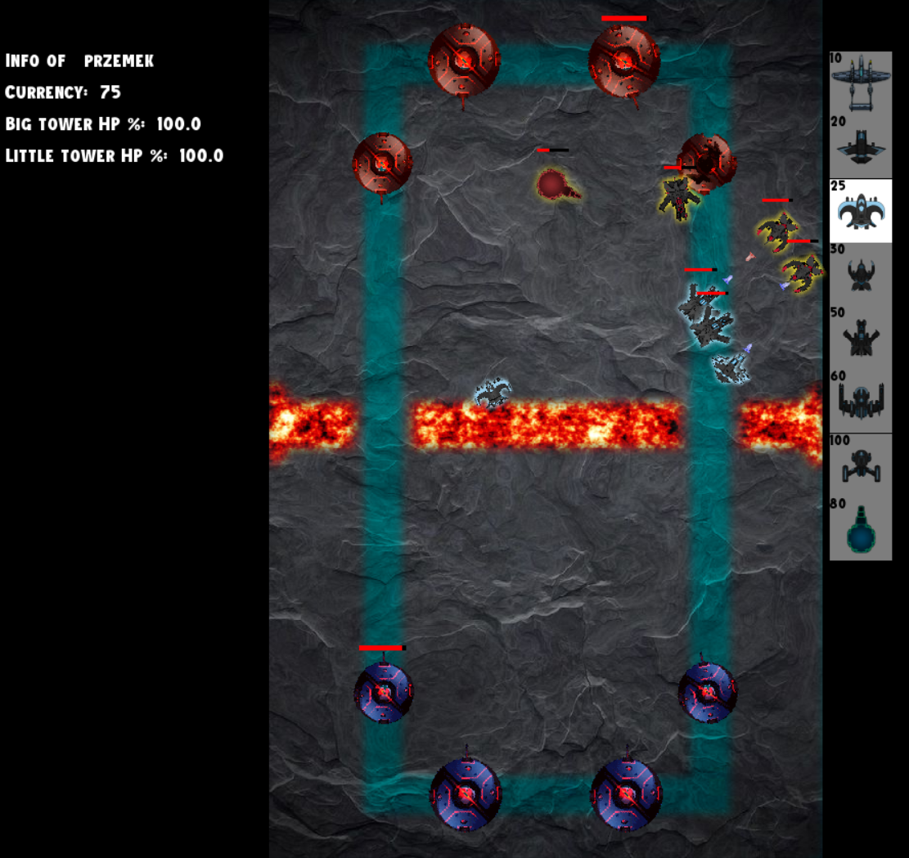
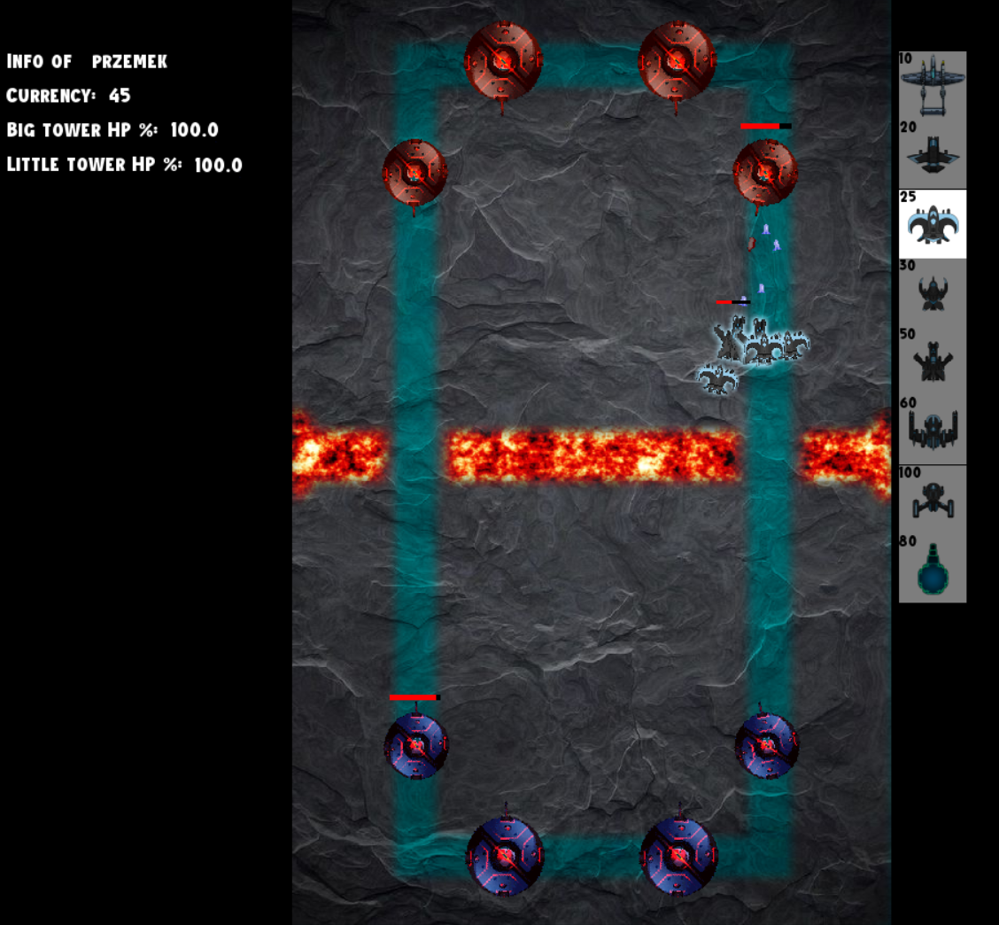
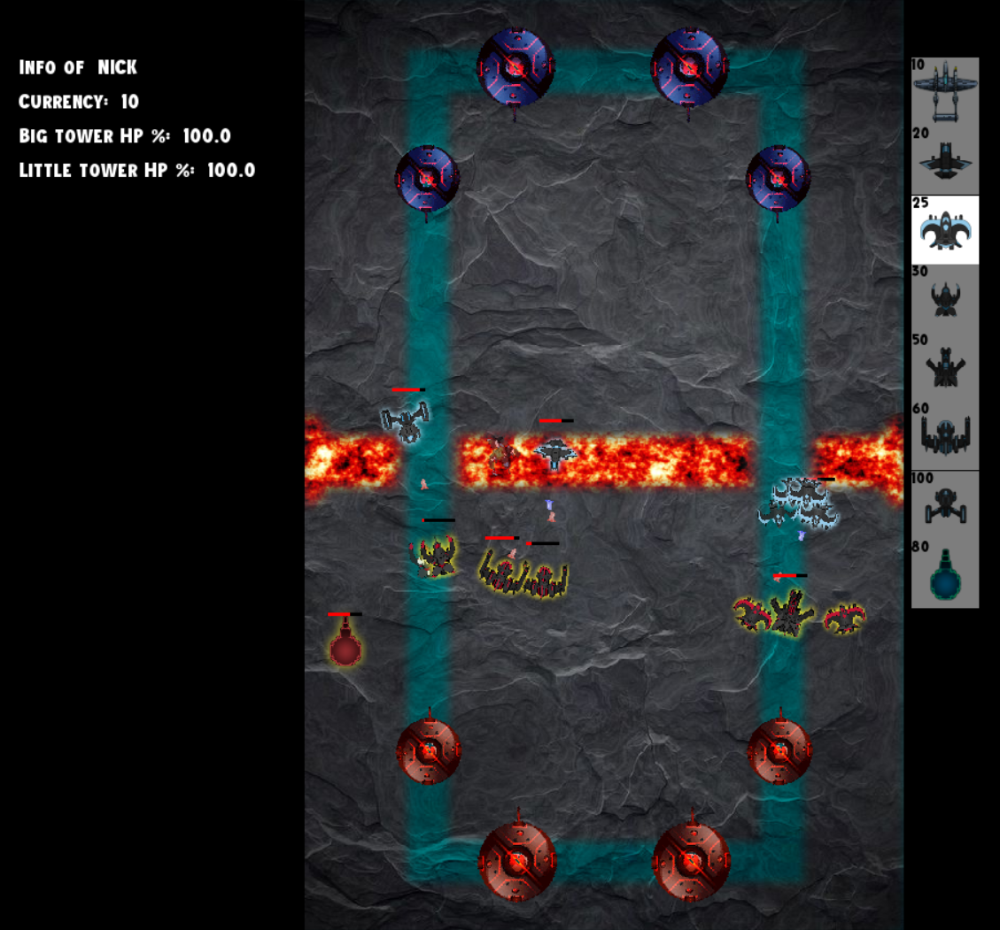
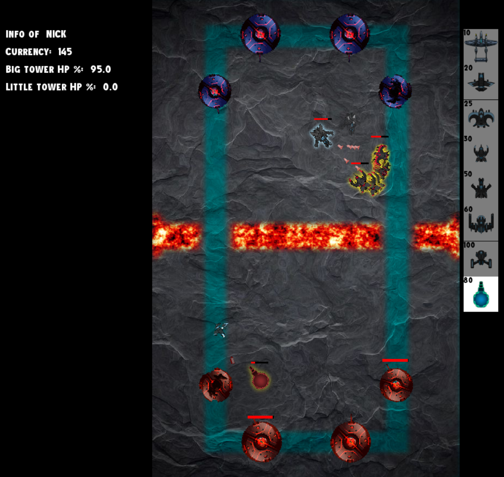
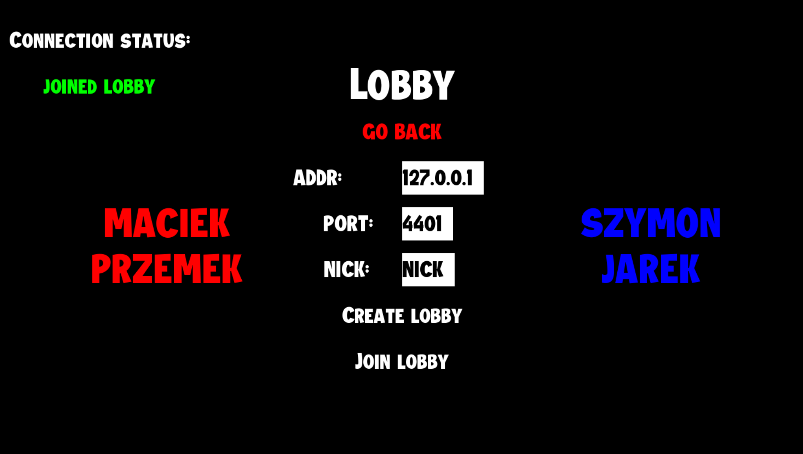

# Fortress Masters
Fortress Masters is a multiplayer real-time strategy game. 
The game combines tower defense and tower rush aspects, 
where the main objective for the players is to 
destroy the enemies' towers while defending theirs.

## Gameplay
|  |  |
|----------------------------------------------------|----------------------------------------------------|
|  |  |

Players compete in 2v2 format. 

Players spend the currency to pick units from the Unit Selection Bar (on the right side) and place them on their half of the map. 
Upon being placed, units (excluding tower-like units) start moving towards enemies' nearest tower.
If enemy unit appears on their way, they start fighting. 

Currency is obtained through passive income. 
If a player's Main Tower got destroyed, he loses passive income.

We have a plan to implement possibility to upgrade the Main Tower 
for the players, to make it stronger and amplify the passive income, 
but currently passive income is same for every player.

## Creating and joining a game
Game is based on a sever-client architecture. 
Server is launched by one of the players on the chosen port in a TCP mode.
When 4 players connect to the lobby, the player who created a lobby can start the game.


## Setup guide
1. Clone the repository
2. Go to project folder, and install requirements
```
   pip install -r requirements.txt
```
## Used technologies
 - Python 3.9
 - Pygame 2.1.2
### Textures
[https://gisha.itch.io/spaceships-asset-pack](https://gisha.itch.io/spaceships-asset-pack)


